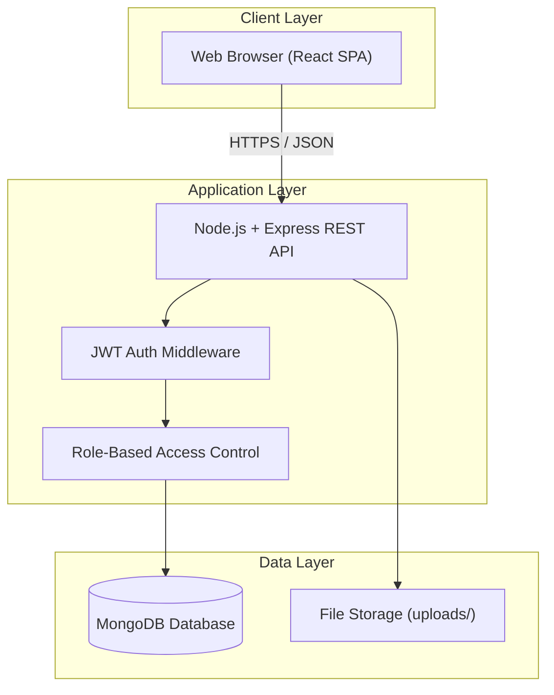
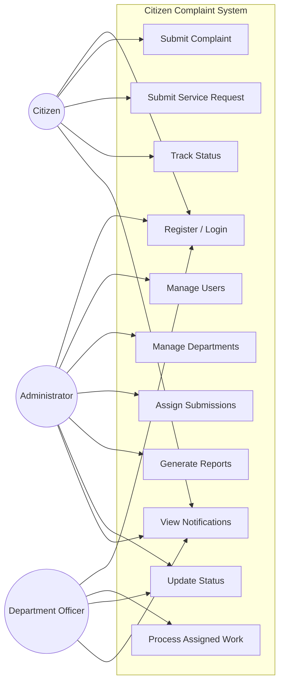
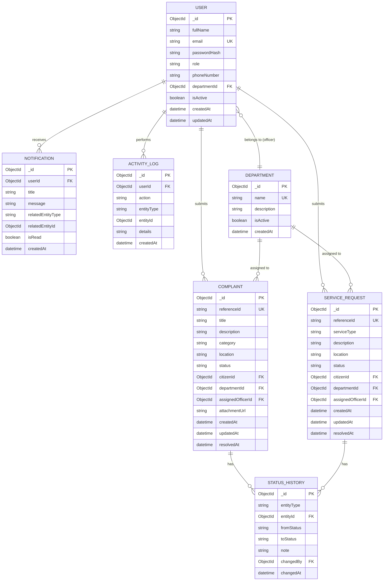
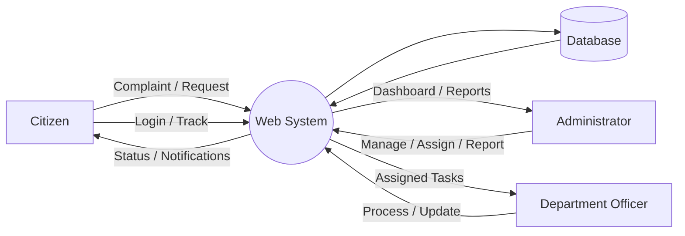
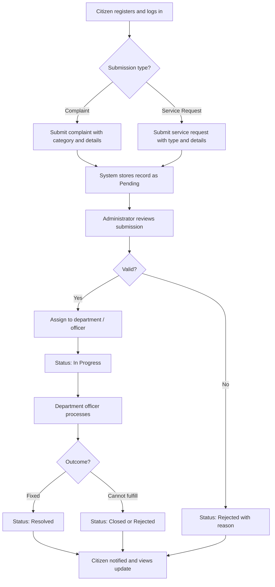
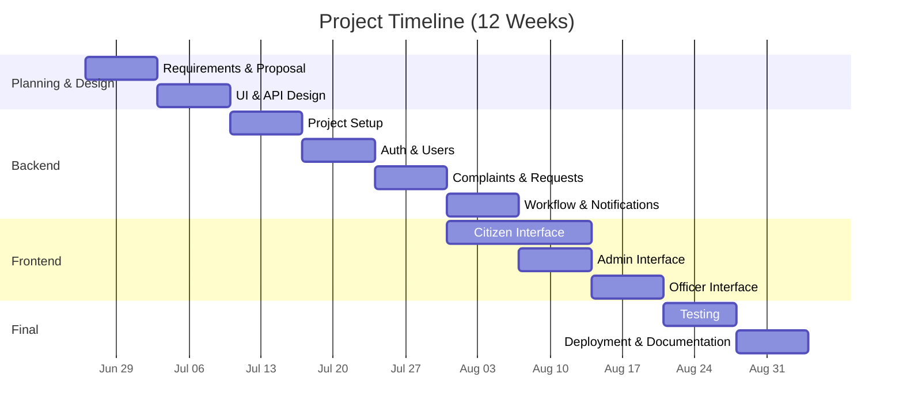
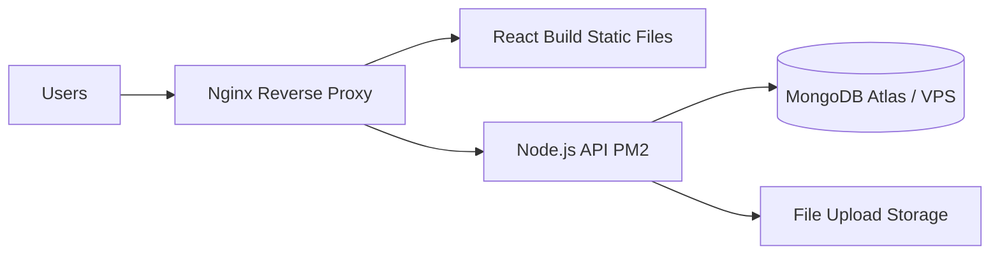

# PROJECT PROPOSAL

## Web-Based Citizen Complaint and Service Request Management System for Adama City Administration

---

| Field | Detail |
|-------|--------|
| **Project Title** | Web-Based Citizen Complaint and Service Request Management System |
| **Organization** | Adama City Administration |
| **Document Version** | 2.0 (Updated) |
| **Date** | June 26, 2025 |
| **Prepared By** | [Student / Team Name] |
| **Institution** | [University / Department Name] |
| **Supervisor** | [Supervisor Name] |

---

## Table of Contents

1. [Background of the Study](#1-background-of-the-study)
2. [Problem Statement](#2-problem-statement)
3. [Literature Review and Related Work](#3-literature-review-and-related-work)
4. [General Objective](#4-general-objective)
5. [Specific Objectives](#5-specific-objectives)
6. [Scope of the Project](#6-scope-of-the-project)
7. [Limitations](#7-limitations)
8. [Proposed System](#8-proposed-system)
9. [Actors of the System](#9-actors-of-the-system)
10. [Functional Requirements](#10-functional-requirements)
11. [Non-Functional Requirements](#11-non-functional-requirements)
12. [System Analysis and Design](#12-system-analysis-and-design)
13. [System Workflow](#13-system-workflow)
14. [Technology Stack and Development Tools](#14-technology-stack-and-development-tools)
15. [Database Design](#15-database-design)
16. [Methodology](#16-methodology)
17. [Project Timeline](#17-project-timeline)
18. [Testing Strategy](#18-testing-strategy)
19. [Deployment Plan](#19-deployment-plan)
20. [Expected Benefits](#20-expected-benefits)
21. [Expected Outcome](#21-expected-outcome)
22. [Future Enhancements](#22-future-enhancements)
23. [References](#23-references)

---

## 1. Background of the Study

Adama City Administration provides various municipal services to citizens. Citizens often need to submit complaints regarding public services such as road maintenance, waste management, water supply, street lighting, and other community-related issues. In addition, citizens may request different municipal services from the city administration.

Currently, many complaints and service requests are handled manually through paper-based processes or office visits. This leads to:

- Delays in service delivery
- Poor record management
- Limited tracking capabilities
- Reduced transparency between citizens and administration

To address these challenges, a **web-based system** is proposed to allow citizens to submit complaints and service requests online, track their progress in real time, and receive feedback from responsible departments.

---

## 2. Problem Statement

The existing complaint and service request management process faces several challenges:

- Manual handling of complaints and requests
- Difficulty in tracking complaint status
- Delayed response from responsible departments
- Lack of centralized data storage
- Poor communication between citizens and city administration
- Limited reporting and monitoring capabilities
- Inefficient record management
- No audit trail for status changes
- No standardized categories for complaints and service types

---

## 3. Literature Review and Related Work

Several municipal and e-governance systems demonstrate the value of digital complaint management:

| System / Study | Approach | Relevance |
|----------------|----------|-----------|
| **FixMyStreet (UK)** | Web-based geo-tagged reporting | Shows citizen-driven reporting improves response times |
| **311 Systems (USA)** | Centralized non-emergency service requests | Model for categorization and department routing |
| **Ethiopian e-Service initiatives** | Government digital transformation | Aligns with national push for digital public services |
| **CRM-based municipal portals** | Role-based dashboards and ticketing | Supports assignment, tracking, and reporting workflows |

**Gap identified:** Adama City Administration lacks a dedicated, centralized web platform that connects citizens, administrators, and department officers with transparent status tracking and reporting. This project fills that gap using a modern MERN stack suitable for rapid development and scalability.

---

## 4. General Objective

To develop a web-based citizen complaint and service request management system for Adama City Administration that improves transparency, efficiency, and accountability in municipal service delivery.

---

## 5. Specific Objectives

- To provide online citizen registration and secure authentication
- To enable citizens to submit complaints electronically with categories and optional attachments
- To enable citizens to submit service requests electronically with predefined service types
- To provide complaint and request tracking functionality with status history
- To provide role-based administrative and department dashboards
- To improve communication through in-app notifications
- To generate reports and statistics for decision-making
- To maintain centralized, searchable records of complaints and requests
- To support department-based assignment and processing workflows

---

## 6. Scope of the Project

### 6.1 In Scope

- User registration, login, and password reset
- Complaint submission with category, location, and optional photo upload
- Service request submission with service type and description
- Status tracking with history (Pending, In Progress, Resolved, Rejected, Closed)
- Role-based access: Citizen, Administrator, Department Officer
- User and department management (Administrator)
- Complaint/request assignment to departments
- Search and filter (by ID, status, category, date)
- In-app notifications on status changes
- Dashboard with summary statistics
- Report generation (counts by status, category, department, date range)
- Activity/audit log for administrative actions

### 6.2 Out of Scope

- Online payment processing
- Advanced GIS mapping and interactive maps
- SMS and email notifications (planned as future enhancements)
- Native mobile applications (web-responsive only in this phase)
- Multi-language support (planned as future enhancement)

### 6.3 Distinction: Complaint vs Service Request

| Aspect | Complaint | Service Request |
|--------|-----------|-----------------|
| **Purpose** | Report a problem or failure in existing service | Request a new or additional municipal service |
| **Examples** | Broken streetlight, garbage not collected, water leak | Request waste bin, street cleaning, permit inquiry |
| **Typical flow** | Report → Investigate → Fix | Request → Review → Fulfill |

---

## 7. Limitations

- Requires internet access; citizens without connectivity must still use offline channels
- Initial deployment assumes manual setup of departments and officer accounts by administrators
- File uploads limited to images (JPEG, PNG) up to 5 MB per attachment
- System language is English only in Phase 1
- No integration with existing legacy paper records
- Performance targets assume moderate concurrent usage (up to 500 simultaneous users)

---

## 8. Proposed System

The proposed system is a **web-based application** accessible through modern browsers. It follows a three-tier architecture: React frontend, Node.js/Express API, and MongoDB database.

### 8.1 Citizens Can

- Create accounts and manage profiles
- Log in securely with JWT-based sessions
- Submit complaints with category, description, location, and optional photo
- Submit service requests with service type and description
- View and track status of all their submissions
- Receive in-app notifications when status changes
- Search and filter their own submissions

### 8.2 Administrators Can

- Manage users (create, update, deactivate)
- Manage departments and assign officers to departments
- View all complaints and service requests
- Assign submissions to appropriate departments
- Update statuses and add internal notes
- Generate reports and view dashboard analytics
- Monitor system activity via audit logs

### 8.3 Department Officers Can

- View complaints and requests assigned to their department
- Process assigned items and update progress
- Add resolution notes
- Mark tasks as resolved, rejected, or closed
- View department-level statistics

---

## 9. Actors of the System

### 9.1 Citizen

**Responsibilities:** Register account, log in, submit complaints and service requests, view status, update profile, receive notifications.

### 9.2 Administrator

**Responsibilities:** Manage users and departments, assign submissions, update statuses, generate reports, monitor system activities, configure categories and service types.

### 9.3 Department Officer

**Responsibilities:** View assigned work, process complaints and requests, update progress, add notes, mark tasks completed. Each officer belongs to one department (e.g., Water, Roads, Sanitation).

---

## 10. Functional Requirements

| ID | Requirement | Description |
|----|-------------|-------------|
| FR-01 | User registration | Citizens register with full name, email, phone, and password |
| FR-02 | User login | Authenticate with email and password; receive JWT token |
| FR-03 | Password management | Change password; reset password via email token (Phase 1: admin-assisted reset optional) |
| FR-04 | Profile management | Update name, phone; view submission history |
| FR-05 | Complaint submission | Submit with title, description, category, location, optional attachment |
| FR-06 | Service request submission | Submit with service type, description, optional location |
| FR-07 | Status tracking | View current status and full status history timeline |
| FR-08 | Dashboard | Role-specific dashboards with counts and recent items |
| FR-09 | User management | Admin CRUD for users and role assignment |
| FR-10 | Department management | Admin CRUD for departments and officer assignment |
| FR-11 | Assignment | Admin assigns submission to department; optional officer |
| FR-12 | Report generation | Export/view reports by status, category, department, date |
| FR-13 | Search | Search by reference ID, keyword, status, category, date range |
| FR-14 | Notifications | In-app notifications on assignment and status change |
| FR-15 | Audit log | Record who changed status and when |

### 10.1 Complaint Categories (Predefined)

Road Maintenance, Waste Management, Water Supply, Street Lighting, Drainage, Public Safety, Noise Pollution, Other.

### 10.2 Service Types (Predefined)

Waste Collection Request, Street Cleaning, Water Connection Inquiry, Public Facility Access, General Information, Other.

### 10.3 Status Values

| Status | Description |
|--------|-------------|
| **Pending** | Submitted; awaiting admin review |
| **In Progress** | Assigned and being processed |
| **Resolved** | Issue addressed or service fulfilled |
| **Rejected** | Invalid or out of scope (with reason) |
| **Closed** | Closed without further action or citizen confirmed |

---

## 11. Non-Functional Requirements

### 11.1 Security

- Password hashing with bcrypt (never store plain text)
- JWT authentication with expiration and refresh strategy
- Role-based access control (RBAC) on all API routes
- HTTPS in production
- Input validation and sanitization (prevent XSS, injection)
- Rate limiting on login and submission endpoints
- Secure file upload validation (type and size)

### 11.2 Performance

- API response time under 2 seconds for typical requests
- Pagination for list endpoints (default 20 items per page)
- Indexed database queries on status, citizenId, departmentId, createdDate

### 11.3 Reliability

- Consistent operation with structured error handling
- Automated MongoDB backups (daily in production)
- Graceful degradation when optional features (e.g., file upload) fail

### 11.4 Usability

- Responsive design for desktop and mobile browsers
- Clear navigation and accessible forms with validation messages
- Consistent UI patterns across citizen and admin interfaces

### 11.5 Scalability

- Stateless API design for horizontal scaling
- MongoDB sharding/replica sets as user base grows

### 11.6 Maintainability

- Modular code structure (routes, controllers, models, middleware)
- API documentation via Postman collection
- Version control with Git and GitHub

---

## 12. System Analysis and Design

### 12.1 System Architecture

### 12.2 Use Case Diagram

### 12.3 Entity-Relationship Diagram

### 12.4 Data Flow Diagram (Level 0)

---

## 13. System Workflow

**Step-by-step:**

1. Citizen registers an account and verifies email (optional in Phase 1).
2. Citizen logs into the system.
3. Citizen submits a complaint or service request.
4. System generates a unique reference ID and stores the record as **Pending**.
5. Administrator reviews the submission.
6. Administrator assigns the request to the appropriate department (and optionally an officer).
7. Status changes to **In Progress**; citizen receives notification.
8. Department officer processes the request and updates progress notes.
9. Officer or admin sets final status: **Resolved**, **Rejected**, or **Closed**.
10. Status history and audit log are recorded; citizen views progress in dashboard.

---

## 14. Technology Stack and Development Tools

| Layer | Technology | Purpose |
|-------|------------|---------|
| **Frontend** | React.js, HTML5, CSS3, JavaScript | Single-page user interface |
| **UI** | React Router, Axios | Routing and API communication |
| **Backend** | Node.js, Express.js | REST API server |
| **Database** | MongoDB, Mongoose | Document storage and ODM |
| **Authentication** | JWT, bcrypt | Secure sessions and password hashing |
| **Validation** | express-validator | Request validation |
| **File Upload** | multer | Complaint image attachments |
| **Development** | Visual Studio Code, Postman, Git, GitHub | Coding, API testing, version control |

**Note on database choice:** MongoDB supports flexible schemas for complaints and requests. Relational integrity is enforced at the application layer via Mongoose references. PostgreSQL is a viable alternative if strict relational reporting is required later.

---

## 15. Database Design

### 15.1 Collections Overview

| Collection | Purpose |
|------------|---------|
| `users` | All system users (citizens, admins, officers) |
| `departments` | Municipal departments |
| `complaints` | Citizen complaint records |
| `serviceRequests` | Citizen service request records |
| `statusHistories` | Status change audit trail |
| `notifications` | In-app user notifications |
| `activityLogs` | Administrative action logs |

### 15.2 Users Collection

| Field | Type | Description |
|-------|------|-------------|
| `_id` | ObjectId | Primary key |
| `fullName` | String | User full name |
| `email` | String | Unique email (login) |
| `passwordHash` | String | Bcrypt-hashed password (not plain text) |
| `role` | Enum | `citizen`, `admin`, `officer` |
| `phoneNumber` | String | Contact number |
| `departmentId` | ObjectId | FK to departments (officers only) |
| `isActive` | Boolean | Account enabled/disabled |
| `createdAt` | Date | Registration date |
| `updatedAt` | Date | Last profile update |

**Indexes:** `email` (unique), `role`, `departmentId`

### 15.3 Departments Collection

| Field | Type | Description |
|-------|------|-------------|
| `_id` | ObjectId | Primary key |
| `name` | String | e.g., Water Supply, Roads |
| `description` | String | Department description |
| `isActive` | Boolean | Active flag |
| `createdAt` | Date | Created date |

**Indexes:** `name` (unique)

### 15.4 Complaints Collection

| Field | Type | Description |
|-------|------|-------------|
| `_id` | ObjectId | Primary key |
| `referenceId` | String | Human-readable ID (e.g., CMP-2025-0001) |
| `title` | String | Short title |
| `description` | String | Full description |
| `category` | Enum | Predefined category |
| `location` | String | Address or area description |
| `status` | Enum | pending, in_progress, resolved, rejected, closed |
| `citizenId` | ObjectId | FK to users |
| `departmentId` | ObjectId | FK to departments |
| `assignedOfficerId` | ObjectId | FK to users (optional) |
| `attachmentUrl` | String | Optional photo path |
| `resolutionNote` | String | Officer/admin resolution text |
| `createdAt` | Date | Submission date |
| `updatedAt` | Date | Last update |
| `resolvedAt` | Date | Resolution timestamp |

**Indexes:** `referenceId` (unique), `citizenId`, `departmentId`, `status`, `createdAt`

### 15.5 Service Requests Collection

| Field | Type | Description |
|-------|------|-------------|
| `_id` | ObjectId | Primary key |
| `referenceId` | String | e.g., SRV-2025-0001 |
| `serviceType` | Enum | Predefined service type |
| `description` | String | Request details |
| `location` | String | Optional location |
| `status` | Enum | Same as complaints |
| `citizenId` | ObjectId | FK to users |
| `departmentId` | ObjectId | FK to departments |
| `assignedOfficerId` | ObjectId | FK to users (optional) |
| `resolutionNote` | String | Resolution text |
| `createdAt` | Date | Submission date |
| `updatedAt` | Date | Last update |
| `resolvedAt` | Date | Resolution timestamp |

**Indexes:** `referenceId` (unique), `citizenId`, `departmentId`, `status`, `createdAt`

### 15.6 Status Histories Collection

| Field | Type | Description |
|-------|------|-------------|
| `_id` | ObjectId | Primary key |
| `entityType` | Enum | `complaint`, `serviceRequest` |
| `entityId` | ObjectId | FK to complaint or request |
| `fromStatus` | String | Previous status |
| `toStatus` | String | New status |
| `note` | String | Optional comment |
| `changedBy` | ObjectId | FK to users |
| `changedAt` | Date | Timestamp |

### 15.7 Notifications Collection

| Field | Type | Description |
|-------|------|-------------|
| `_id` | ObjectId | Primary key |
| `userId` | ObjectId | FK to users |
| `title` | String | Notification title |
| `message` | String | Notification body |
| `relatedEntityType` | String | complaint / serviceRequest |
| `relatedEntityId` | ObjectId | Related record ID |
| `isRead` | Boolean | Read flag |
| `createdAt` | Date | Created timestamp |

**Indexes:** `userId`, `isRead`, `createdAt`

---

## 16. Methodology

This project follows an **Agile-inspired iterative development** approach suited for a academic/software engineering project:

| Phase | Activities |
|-------|------------|
| **1. Requirements** | Gather requirements, define scope, document actors and use cases |
| **2. Design** | Architecture, ER diagram, API design, UI wireframes |
| **3. Implementation** | Backend API first, then frontend integration, feature by feature |
| **4. Testing** | Unit, integration, and user acceptance testing |
| **5. Deployment** | Deploy to staging, then production server |
| **6. Documentation** | User manual, API docs, final report |

**Development order (recommended):**

1. Project setup and database models
2. Authentication and user management
3. Complaint and service request CRUD
4. Assignment and status workflow
5. Notifications and audit log
6. Dashboard and reports
7. Testing and deployment

---

## 17. Project Timeline

**Estimated duration:** 12 weeks

| Week | Phase | Tasks | Deliverables |
|------|-------|-------|--------------|
| 1 | Planning | Finalize requirements, proposal, ER diagram | Approved proposal |
| 2 | Design | UI wireframes, API specification, DB schema | Design documents |
| 3 | Setup | Init React + Node + MongoDB, Git repo, folder structure | Project scaffold |
| 4 | Backend Core | Auth (JWT), user model, department model | Working login/register API |
| 5 | Backend Features | Complaint and service request APIs | CRUD endpoints |
| 6 | Backend Workflow | Assignment, status history, notifications | Workflow APIs |
| 7 | Frontend Core | Login, register, citizen dashboard | Citizen UI shell |
| 8 | Frontend Citizen | Submit complaint/request, track status | Citizen features complete |
| 9 | Frontend Admin | Admin dashboard, user/dept management, assignment | Admin UI complete |
| 10 | Frontend Officer | Officer dashboard, process assigned items | Officer UI complete |
| 11 | Testing | Unit tests, integration tests, UAT, bug fixes | Test report |
| 12 | Deployment | Deploy backend and frontend, documentation, final report | Live system + report |

### Gantt Chart

---

## 18. Testing Strategy

| Test Type | Scope | Tools / Method |
|-----------|-------|----------------|
| **Unit Testing** | Models, utilities, validation logic | Jest |
| **API Integration Testing** | REST endpoints, auth, RBAC | Postman / Supertest |
| **Frontend Testing** | Component rendering, form validation | React Testing Library (optional) |
| **Security Testing** | Auth bypass, role escalation, input injection | Manual + Postman |
| **User Acceptance Testing (UAT)** | End-to-end citizen, admin, officer flows | Test cases with stakeholders |

### Sample Test Cases

| ID | Scenario | Expected Result |
|----|----------|-----------------|
| TC-01 | Citizen registers with valid data | Account created; can log in |
| TC-02 | Citizen submits complaint | Record saved as Pending with reference ID |
| TC-03 | Admin assigns complaint to department | Status In Progress; officer sees item |
| TC-04 | Officer marks complaint resolved | Status Resolved; citizen notified |
| TC-05 | Officer tries to access admin routes | 403 Forbidden |
| TC-06 | Search complaint by reference ID | Correct record returned |

---

## 19. Deployment Plan

### 19.1 Environment Setup

| Environment | Purpose |
|-------------|---------|
| **Development** | Local machine (localhost) |
| **Staging** | Pre-production testing on cloud VPS |
| **Production** | Live system for Adama City Administration |

### 19.2 Deployment Architecture

### 19.3 Deployment Steps

1. Configure environment variables (`.env`): `MONGODB_URI`, `JWT_SECRET`, `PORT`
2. Build React frontend: `npm run build`
3. Deploy API with PM2 or similar process manager
4. Serve frontend static files via Nginx
5. Enable HTTPS with SSL certificate (Let's Encrypt)
6. Configure daily MongoDB backups
7. Seed initial admin account and default departments

### 19.4 Minimum Server Requirements

- 2 GB RAM, 2 vCPU VPS (or MongoDB Atlas free tier for development)
- Ubuntu 22.04 LTS or similar
- Node.js 18+ LTS

---

## 20. Expected Benefits

### For Citizens

- Easy online complaint and request submission
- Faster access to municipal services
- Transparency in service delivery
- Real-time status tracking and notifications

### For Adama City Administration

- Improved centralized record management
- Better monitoring and departmental accountability
- Faster response to citizens
- Improved service quality through data-driven decisions
- Reports for planning and resource allocation

---

## 21. Expected Outcome

The project will deliver a **fully functional web-based system** for managing citizen complaints and service requests. The system will:

- Connect citizens, administrators, and department officers on one platform
- Provide transparent status tracking with audit history
- Generate reports for monitoring and decision-making
- Serve as a foundation for future enhancements (SMS, mobile app, GIS)

---

## 22. Future Enhancements

- SMS notifications for status updates
- Email notifications and password reset via email
- Native mobile application (Android / iOS)
- GIS integration for map-based complaint location
- Advanced analytics dashboard with charts and trends
- Multi-language support (Amharic, Afan Oromo, English)
- Citizen feedback and satisfaction rating after resolution
- SLA tracking and escalation rules
- Integration with existing government systems

---

## 23. References

1. FixMyStreet. *Report, view, or discuss local problems*. mySociety. https://www.fixmystreet.com/
2. IBM. *Entity-Relationship Modeling*. Software Engineering best practices.
3. MongoDB Inc. *MongoDB Documentation*. https://www.mongodb.com/docs/
4. Express.js. *Web framework for Node.js*. https://expressjs.com/
5. React. *A JavaScript library for building user interfaces*. https://react.dev/
6. OWASP. *Authentication Cheat Sheet*. https://cheatsheetseries.owasp.org/
7. Ethiopian Ministry of Innovation and Technology. *Digital Ethiopia 2025* (e-governance context).
8. Sommerville, I. *Software Engineering* (10th ed.). Pearson — requirements and testing methodologies.
9. JWT.io. *JSON Web Token Introduction*. https://jwt.io/introduction
10. Adama City Administration. *Municipal service delivery context* (local organizational reference).

---

## Document Revision History

| Version | Date | Changes |
|---------|------|---------|
| 1.0 | Initial | Original PDF proposal |
| 2.0 | June 26, 2025 | Added ER diagram, timeline, literature review, methodology, testing, deployment, expanded DB schema, use cases, architecture, limitations, references; merged duplicate sections; clarified complaint vs service request |

---

*End of Proposal*
