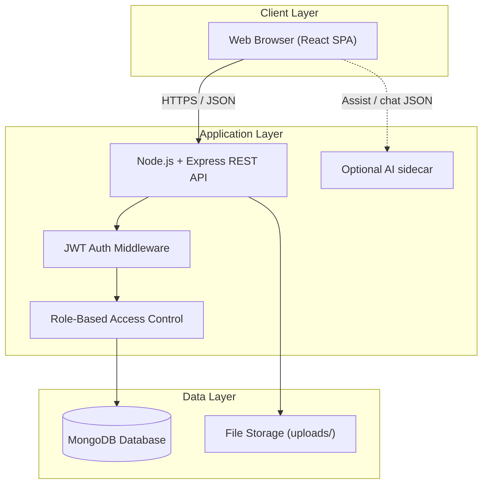
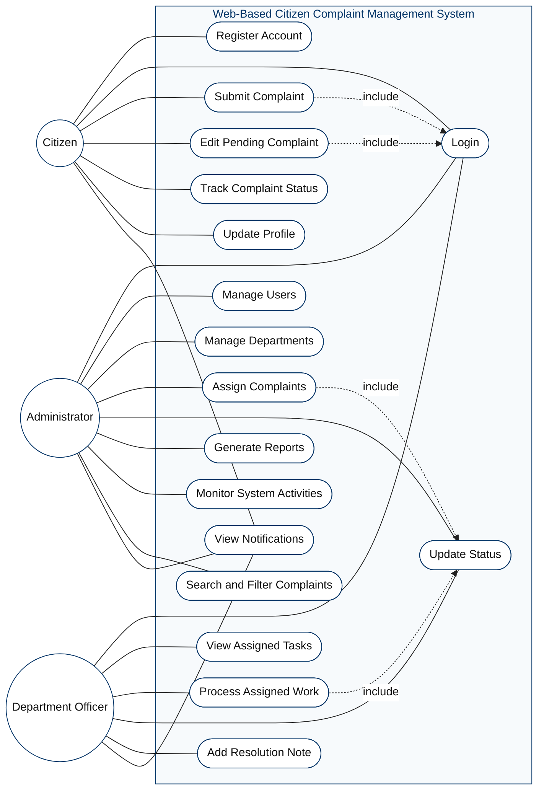
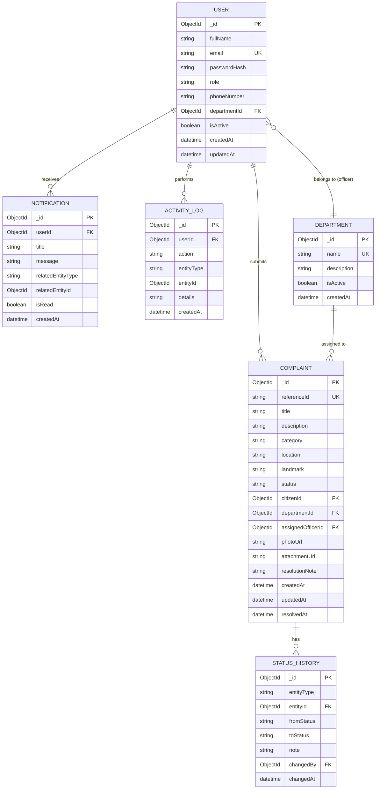
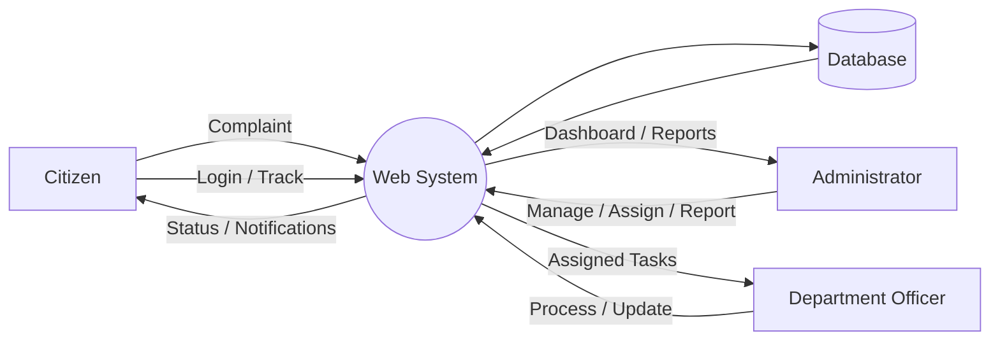
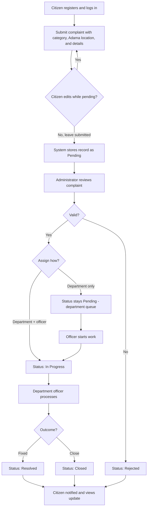
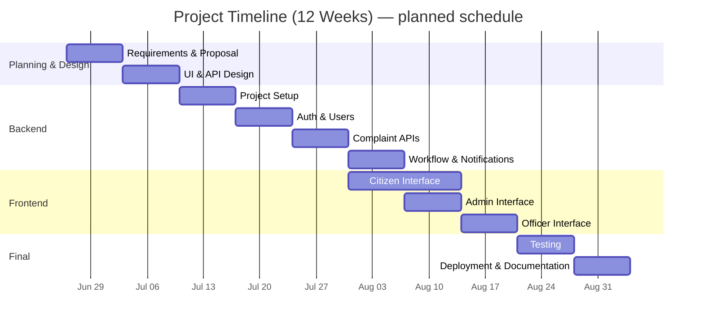
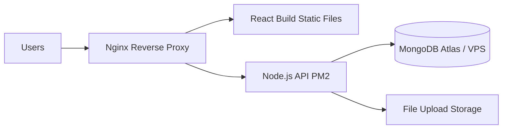

# PROJECT PROPOSAL

## Web-Based Citizen Complaint Management System for Adama City Administration

---

| Field | Detail |
|-------|--------|
| **Project Title** | Web-Based Citizen Complaint Management System |
| **Organization** | Adama City Administration |
| **Document Version** | 2.15 |
| **Date** | 22 August 2026 |
| **Prepared By** | ____________________ (ID: __________) |
| **Institution** | Haramaya University — College of Computing and Informatics, Department of Information Science |
| **Supervisor / Advisor** | ____________________ |
| **Host Organization** | Adama City Administration Science and Technology Office |

---

## Declaration

I hereby declare that this project proposal, titled **"Web-Based Citizen Complaint Management System for Adama City Administration"**, is my original work. It has been prepared as part of the academic requirements of **Haramaya University, College of Computing and Informatics, Department of Information Science** under the guidance of my advisor.

I further declare that:

- This work has not been submitted, in whole or in part, for any other degree, diploma, or academic award at this or any other institution.
- All sources of information used in this document have been properly acknowledged through citations and references.
- The system design, documentation, and implementation described herein represent work carried out by me, except where otherwise stated.

| | |
|--|--|
| **Name** | ____________________ |
| **ID** | __________ |
| **Signature** | ______________________________ |
| **Date** | ____________________ |

---

## Acknowledgement

First and foremost, I would like to thank **Almighty God** for the strength, guidance, and opportunity to complete this project proposal.

I express sincere gratitude to my advisor for continuous guidance, constructive feedback, and encouragement throughout the preparation of this document and the development of the system.

I also thank the instructors and staff of the **Department of Information Science, College of Computing and Informatics, Haramaya University** for the knowledge and support provided during the course of study.

Special appreciation is extended to **Adama City Administration Science and Technology Office** as the host organization for this work, and to colleagues, classmates, and family members who offered advice, motivation, and moral support.

Finally, I acknowledge all authors, developers, and organizations whose published works, documentation, and open-source tools contributed to the completion of this proposal.

---

## Abstract (Executive Summary)

Municipal complaint handling in Adama City Administration has traditionally relied on paper-based processes and office visits. This approach causes delays, weak record keeping, limited status tracking, and reduced transparency between citizens and responsible departments.

This project implements a **Web-Based Citizen Complaint Management System** to digitize submission, assignment, tracking, and reporting of citizen complaints. The system supports three roles: **Citizen**, **Administrator**, and **Department Officer**. Citizens can register, submit categorized complaints (Adama area, optional landmark and photo), edit pending complaints, and track progress using unique reference numbers. Administrators manage users and departments, assign work, update status, and generate reports. Officers process assigned tasks within their department scope and add resolution notes.

The solution is built with the **MERN** stack (MongoDB, Express.js, React, Node.js), using JWT authentication and role-based access control. Optional AI assistance (writing help, triage, resolution drafts, chatbot) runs as a sidecar service. Status history, in-app notifications (marked seen when opened), and email alerts (real mailboxes only) improve accountability and communication.

**Keywords:** citizen complaint, e-governance, Adama City Administration, MERN, role-based access control

### Implementation snapshot (August 2026)

The **delivered application is complaints-only**. A parallel service-request module was removed so citizens, admins, and officers work from one complaint workflow. Location is selected from Adama sub-cities, kebeles 01–18, and landmarks, with an optional extra detail field. Authenticated screens are localized in English, Amharic, and Afaan Oromo. Opening the notifications page marks items as seen automatically. Demo logins (`*@test.com`) do not receive email. The Activity Log stores assignment details with department and officer **names** (not database IDs).

---

## Table of contents

Declaration ................................................................ i
Acknowledgement ............................................................. ii
Abstract (Executive Summary) ................................................ iii
List of Acronyms ............................................................ iv
CHAPTER ONE: INTRODUCTION ................................................... 1
    1.1 Background of the Study ............................................. 1
    1.2 Problem Statement ................................................... 2
    1.3 Objectives .......................................................... 2
        1.3.1 General Objective ............................................. 2
        1.3.2 Specific Objectives ........................................... 2
    1.4 Scope of the Project ................................................ 3
        1.4.1 In Scope ...................................................... 3
        1.4.2 Out of Scope .................................................. 3
        1.4.3 Complaint-only scope .......................................... 3
    1.5 Limitations ......................................................... 4
    1.6 Literature Review and Related Work .................................. 4
CHAPTER TWO: SYSTEM REQUIREMENTS AND DESIGN ................................. 5
    2.1 Proposed System ..................................................... 5
        2.1.1 Citizens Can .................................................. 5
        2.1.2 Administrators Can ............................................ 5
        2.1.3 Department Officers Can ....................................... 6
    2.2 Actors of the System ................................................ 6
        2.2.1 Citizen ....................................................... 6
        2.2.2 Administrator ................................................. 6
        2.2.3 Department Officer ............................................ 6
    2.3 Functional Requirements ............................................. 7
        2.3.1 Complaint Categories (Predefined) ............................. 7
        2.3.2 Location (Adama) .............................................. 7
        2.3.3 Status Values ................................................. 7
        2.3.4 Status Transition Rules (Implemented) ......................... 8
    2.4 Non-Functional Requirements ......................................... 8
        2.4.1 Security ...................................................... 8
        2.4.2 Performance ................................................... 8
        2.4.3 Reliability ................................................... 9
        2.4.4 Usability ..................................................... 9
        2.4.5 Scalability ................................................... 9
        2.4.6 Maintainability ............................................... 9
    2.5 System Architecture ................................................. 10
    2.6 Use Case Diagram .................................................... 10
    2.7 Entity-Relationship Diagram ......................................... 11
    2.8 Data Flow Diagram (Level 0) ......................................... 12
    2.9 System Workflow ..................................................... 12
    2.10 Technology Stack and Development Tools ............................. 13
    2.11 Database Design .................................................... 13
        2.11.1 Collections Overview ......................................... 13
        2.11.2 Users Collection ............................................. 14
        2.11.3 Departments Collection ....................................... 14
        2.11.4 Complaints Collection ........................................ 14
        2.11.5 Status Histories Collection .................................. 15
        2.11.6 Notifications Collection ..................................... 15
CHAPTER THREE: METHODOLOGY AND PROJECT PLAN ................................. 16
    3.1 Methodology ......................................................... 16
    3.2 Project Timeline .................................................... 17
        3.2.1 Gantt Chart ................................................... 17
    3.3 Testing Strategy .................................................... 18
        3.3.1 Sample Test Cases ............................................. 18
    3.4 Deployment Plan ..................................................... 19
        3.4.1 Environment Setup ............................................. 19
        3.4.2 Deployment Architecture ....................................... 19
        3.4.3 Deployment Steps .............................................. 20
        3.4.4 Minimum Server Requirements ................................... 20
CHAPTER FOUR: RESULTS AND DISCUSSION ........................................ 21
    4.1 Results ............................................................. 21
        4.1.1 Public Portal and Authentication .............................. 21
        4.1.2 Citizen Modules ............................................... 22
        4.1.3 Officer Modules ............................................... 23
        4.1.4 Administrator Modules ......................................... 24
    4.2 Discussion .......................................................... 25
    4.3 Expected Benefits ................................................... 26
        4.3.1 For Citizens .................................................. 26
        4.3.2 For Adama City Administration ................................. 26
    4.4 Expected Outcome .................................................... 27
    4.5 Future Enhancements ................................................. 27
CHAPTER FIVE: CONCLUSION .................................................... 28
References .................................................................. 29
Document Revision History ................................................... 30

---

## List of Acronyms

| Acronym | Full Form |
|---------|-----------|
| **AM** | Amharic |
| **API** | Application Programming Interface |
| **CORS** | Cross-Origin Resource Sharing |
| **CRUD** | Create, Read, Update, Delete |
| **CSS** | Cascading Style Sheets |
| **DFD** | Data Flow Diagram |
| **EN** | English |
| **ER** | Entity-Relationship |
| **FK** | Foreign Key |
| **FR** | Functional Requirement |
| **GIS** | Geographic Information System |
| **HTML** | HyperText Markup Language |
| **HTTP** | HyperText Transfer Protocol |
| **HTTPS** | HyperText Transfer Protocol Secure |
| **ID** | Identifier |
| **JSON** | JavaScript Object Notation |
| **JWT** | JSON Web Token |
| **MERN** | MongoDB, Express.js, React, Node.js |
| **ODM** | Object Document Mapper |
| **OM** | Afaan Oromo |
| **PK** | Primary Key |
| **RBAC** | Role-Based Access Control |
| **REST** | Representational State Transfer |
| **SLA** | Service Level Agreement |
| **SMS** | Short Message Service |
| **SPA** | Single-Page Application |
| **SSL** | Secure Sockets Layer |
| **UAT** | User Acceptance Testing |
| **UI** | User Interface |
| **UK** | Unique Key |
| **URL** | Uniform Resource Locator |
| **VPS** | Virtual Private Server |
| **XSS** | Cross-Site Scripting |

---

## CHAPTER ONE: INTRODUCTION

### 1.1 Background of the Study

Adama City Administration provides various municipal services to citizens. Citizens often need to submit complaints regarding public services such as road maintenance, waste management, water supply, street lighting, and other community-related issues. In addition, citizens may request different municipal services from the city administration.

Currently, many complaints are handled manually through paper-based processes or office visits. This leads to:

- Delays in service delivery
- Poor record management
- Limited tracking capabilities
- Reduced transparency between citizens and administration

To address these challenges, a **web-based system** is implemented to allow citizens to submit complaints online, track their progress in real time, and receive feedback from responsible departments.

---

### 1.2 Problem Statement

The existing complaint management process faces several challenges:

- Manual handling of complaints and requests
- Difficulty in tracking complaint status
- Delayed response from responsible departments
- Lack of centralized data storage
- Poor communication between citizens and city administration
- Limited reporting and monitoring capabilities
- Inefficient record management
- No audit trail for status changes
- No standardized categories for complaints and service types

---

### 1.3 Objectives

#### 1.3.1 General Objective

To develop a web-based citizen complaint management system for Adama City Administration that improves transparency, efficiency, and accountability in municipal service delivery.

---

#### 1.3.2 Specific Objectives

- To provide online citizen registration and secure authentication (including email password reset)
- To enable citizens to submit complaints electronically with category, Adama location, optional landmark, and optional photo
- To allow citizens to edit pending complaints before they are assigned
- To provide complaint tracking with status history and unique reference IDs
- To provide role-based administrative and department dashboards
- To improve communication through in-app notifications and optional email
- To generate reports and statistics for decision-making
- To maintain centralized, searchable records of complaints
- To support department-based assignment and processing workflows
- To offer optional AI assistance for drafting, triage, and FAQ (suggestions only)

---

### 1.4 Scope of the Project

#### 1.4.1 In Scope

- User registration and login (JWT authentication) with email password reset
- Complaint submission with category, Adama area dropdown, optional landmark, and optional photo
- Citizen edit of **pending** complaints
- Status tracking with history (Pending, In Progress, Resolved, Rejected, Closed)
- Role-based access: Citizen, Administrator, Department Officer
- User management (Administrator: view users, activate/deactivate)
- Department management (Administrator: list and add departments)
- Complaint assignment to departments and optional officers
- Search and filter complaints (admin lists; citizens view their own)
- In-app notifications; opening the notifications page marks them seen
- Role-specific dashboards with summary statistics
- In-app report summaries (counts by status, category, department)
- Activity/audit log for administrative actions
- Multi-language UI (English, Amharic, Afaan Oromo) for public and authenticated screens
- Optional AI assist (citizen writing, admin triage, officer resolution draft, chatbot)
- Email notifications to real mailboxes (demo `@test.com` addresses are skipped)
- Success feedback (submission popup; action toasts)

#### 1.4.2 Out of Scope

- Online payment processing
- Advanced GIS mapping and interactive maps (Adama area list is used instead)
- Live SMS to real phones (Africa’s Talking sandbox is available but off by default)
- Native mobile applications (web-responsive only in this phase)
- Full user/department CRUD (edit/delete), complaint delete, and report export
- JWT refresh tokens, API rate limiting, and list pagination (planned hardening)
- A separate service-request workflow (removed from the implemented system)

#### 1.4.3 Complaint-only scope

Earlier drafts distinguished **complaints** (report a failure) from **service requests** (ask for a new service). The **implemented system records municipal issues as complaints only**, so routing, tracking, and reporting stay on one path. Guest “municipal services” cards on the landing page describe issue categories; they are not a second request form.

---

### 1.5 Limitations

- Requires internet access; citizens without connectivity must still use offline channels
- Initial deployment assumes manual setup of departments and officer accounts by administrators
- File uploads limited to images (including JPEG, PNG, WebP, GIF) up to **2 MB** per attachment
- Demo accounts (`citizen@test.com`, `admin@test.com`, `officer@test.com`) are for login only and do not receive email
- No integration with existing legacy paper records
- Performance targets assume moderate concurrent usage (up to 500 simultaneous users)

---

### 1.6 Literature Review and Related Work

Several municipal and e-governance systems demonstrate the value of digital complaint management:

| System / Study | Approach | Relevance |
|----------------|----------|-----------|
| **FixMyStreet (UK)** | Web-based geo-tagged reporting | Shows citizen-driven reporting improves response times |
| **311 Systems (USA)** | Centralized non-emergency service requests | Model for categorization and department routing |
| **Ethiopian e-Service initiatives** | Government digital transformation | Aligns with national push for digital public services |
| **CRM-based municipal portals** | Role-based dashboards and ticketing | Supports assignment, tracking, and reporting workflows |

**Gap identified:** Adama City Administration lacks a dedicated, centralized web platform that connects citizens, administrators, and department officers with transparent status tracking and reporting. This project fills that gap using a modern MERN stack suitable for rapid development and scalability.

---

## CHAPTER TWO: SYSTEM REQUIREMENTS AND DESIGN

### 2.1 Proposed System

The proposed system is a **web-based application** accessible through modern browsers. It follows a three-tier architecture: React frontend, Node.js/Express API, and MongoDB database.

#### 2.1.1 Citizens Can

- Create accounts and manage profiles (name, phone)
- Log in securely with JWT-based sessions; reset password by email
- Submit complaints with category, Adama location, optional landmark, description, and optional photo
- Use optional AI writing assist and browser voice input on the complaint form
- Edit a complaint while it is still **pending**
- View and track status of their complaints (with reference ID)
- Receive in-app notifications (marked seen when the notifications page is opened)
- View their own complaints from the citizen dashboard

#### 2.1.2 Administrators Can

- View users and activate/deactivate accounts
- Add departments and view department list
- View all complaints (search/filter)
- Assign complaints to departments and optionally to officers
- Use optional AI triage suggestions when routing
- Reject pending complaints; resolve/close in-progress items
- View report summaries and dashboard analytics
- Monitor system activity via audit logs

#### 2.1.3 Department Officers Can

- View personally assigned items and unassigned items in their department queue
- Start work (Pending → In Progress)
- Add resolution notes
- Mark tasks as **Resolved** or **Closed** (officers cannot reject)
- View officer dashboard statistics

---

### 2.2 Actors of the System

#### 2.2.1 Citizen

**Responsibilities:** Register account, log in, submit complaints, edit pending complaints, view status, update profile, receive notifications.

#### 2.2.2 Administrator

**Responsibilities:** View and activate/deactivate users, add departments, assign submissions, update/reject statuses, view report summaries, monitor system activities.

#### 2.2.3 Department Officer

**Responsibilities:** View assigned work and department queue, process complaints, update progress, add notes, mark tasks resolved or closed. Each officer belongs to one department (e.g., Water, Roads, Sanitation). Officers cannot reject submissions.

---

### 2.3 Functional Requirements

| ID | Requirement | Description |
|----|-------------|-------------|
| FR-01 | User registration | Citizens register with full name, email, phone, and password |
| FR-02 | User login | Authenticate with email and password; receive JWT token |
| FR-03 | Profile management | Update name and phone; view account role |
| FR-04 | Complaint submission | Submit with title, description, category, Adama location, optional landmark, optional photo |
| FR-05 | Edit pending complaint | Citizen updates a complaint only while status is pending |
| FR-06 | Status tracking | View current status and full status history timeline |
| FR-07 | Dashboard | Role-specific dashboards with counts and recent items |
| FR-08 | User management | Admin lists users and activates/deactivates accounts |
| FR-09 | Department management | Admin lists and adds departments |
| FR-10 | Assignment | Admin assigns submission to department; optional officer |
| FR-11 | Report summaries | View counts by status, category, and department |
| FR-12 | Search | Admin search/filter by reference ID, keyword, and status |
| FR-13 | Notifications | In-app notifications on assignment and status change |
| FR-14 | Audit log | Record who changed status and when |
| FR-15 | Success feedback | Confirm successful submissions and admin/officer actions |

#### 2.3.1 Complaint Categories (Predefined)

Road Maintenance, Waste Management, Water Supply, Street Lighting, Drainage, Public Safety, Noise Pollution, Other.

#### 2.3.2 Location (Adama)

Required area key from sub-cities (Lugo, Dabe, Bole, Dembela, Aba Geda, Hawas), kebeles 01–18, or landmarks (Medhanialem, Adama Stadium, Central Bus Station, China Avenue, ASTU, Wonji). Optional landmark / street text (max 120 characters) is stored separately.

#### 2.3.3 Status Values

| Status | Description |
|--------|-------------|
| **Pending** | Submitted; awaiting review or sitting in a department queue |
| **In Progress** | Assigned to an officer and being processed |
| **Resolved** | Issue addressed or service fulfilled |
| **Rejected** | Invalid or out of scope (admin only) |
| **Closed** | Closed without further action |

#### 2.3.4 Status Transition Rules (Implemented)

| Role | From | Allowed next statuses |
|------|------|------------------------|
| Officer | Pending | In Progress |
| Officer | In Progress | Resolved, Closed |
| Admin | Pending | Rejected |
| Admin | In Progress | Resolved, Closed, Rejected |
| Admin | Resolved | Closed |

**Assignment note:** Routing to a **department only** keeps status **Pending**. Assigning (or claiming) an **officer** moves the item to **In Progress**.

---

### 2.4 Non-Functional Requirements

#### 2.4.1 Security

- Password hashing with bcrypt (never store plain text)
- JWT authentication with configurable expiration (no refresh tokens in Phase 1)
- Role-based access control (RBAC) on API routes and frontend routes
- HTTPS in production
- Input validation and sanitization (prevent XSS, injection)
- Secure file upload validation (type and size; max 2 MB)
- Rate limiting on login and submission endpoints *(planned hardening)*

#### 2.4.2 Performance

- API response time under 2 seconds for typical requests
- Indexed database queries on status, citizenId, departmentId, createdDate
- List pagination *(planned; Phase 1 returns role-scoped full lists)*

#### 2.4.3 Reliability

- Consistent operation with structured error handling
- Automated MongoDB backups (daily in production)
- Graceful degradation when optional features (e.g., file upload) fail

#### 2.4.4 Usability

- Responsive design for desktop and mobile browsers
- Clear navigation and accessible forms with validation messages
- Consistent UI patterns across citizen, admin, and officer interfaces
- Success popups/toasts after key actions
- Multi-language support on the public guest experience (EN/AM/OM)

#### 2.4.5 Scalability

- Stateless API design for horizontal scaling
- MongoDB Atlas replica sets as user base grows

#### 2.4.6 Maintainability

- Modular code structure (routes, controllers, models, middleware)
- API exercises via HTTP client tools (e.g., Postman / Thunder Client)
- Version control with Git and GitHub

---

### 2.5 System Architecture

```mermaid
flowchart TB
    subgraph Client["Client Layer"]
        Browser["Web Browser (React SPA)"]
    end

    subgraph Server["Application Layer"]
        API["Node.js + Express REST API"]
        Auth["JWT Auth Middleware"]
        RBAC["Role-Based Access Control"]
        AI["Optional AI sidecar"]
    end

    subgraph Data["Data Layer"]
        MongoDB[(MongoDB Database)]
        Storage["File Storage (uploads/)"]
    end

    Browser -->|HTTPS / JSON| API
    Browser -.->|Assist / chat JSON| AI
    API --> Auth
    Auth --> RBAC
    RBAC --> MongoDB
    API --> Storage
```

*Figure 2.1: System architecture — complaint portal with optional AI sidecar*

### 2.6 Use Case Diagram

```mermaid
%%{init: {
  "theme": "base",
  "themeVariables": {
    "fontSize": "15px",
    "fontFamily": "Arial",
    "primaryColor": "#FFFFFF",
    "primaryTextColor": "#111111",
    "primaryBorderColor": "#003366",
    "secondaryColor": "#E8EEF7",
    "tertiaryColor": "#FFFFFF",
    "lineColor": "#222222",
    "clusterBkg": "#F7FAFC",
    "clusterBorder": "#003366",
    "titleColor": "#003366",
    "mainBkg": "#FFFFFF",
    "nodeBorder": "#003366",
    "edgeLabelBackground": "#FFFFFF"
  },
  "flowchart": {
    "nodeSpacing": 22,
    "rankSpacing": 55,
    "padding": 16,
    "htmlLabels": true,
    "curve": "basis",
    "useMaxWidth": true
  }
}}%%
flowchart LR
    Citizen((Citizen))

    subgraph System["Web-Based Citizen Complaint Management System"]
        direction TB

        UC_Register([Register Account])
        UC_Login([Login])
        UC_SubmitComplaint([Submit Complaint])
        UC_EditComplaint([Edit Pending Complaint])
        UC_Track([Track Complaint Status])
        UC_Profile([Update Profile])
        UC_Notify([View Notifications])

        UC_Users([Manage Users])
        UC_Depts([Manage Departments])
        UC_Assign([Assign Complaints])
        UC_Update([Update Status])
        UC_Reports([Generate Reports])
        UC_Activity([Monitor System Activities])
        UC_Search([Search and Filter Complaints])

        UC_Tasks([View Assigned Tasks])
        UC_Process([Process Assigned Work])
        UC_Note([Add Resolution Note])
    end

    Admin((Administrator))
    Officer((Department Officer))

    Citizen --- UC_Register
    Citizen --- UC_Login
    Citizen --- UC_SubmitComplaint
    Citizen --- UC_EditComplaint
    Citizen --- UC_Track
    Citizen --- UC_Profile
    Citizen --- UC_Notify

    Admin --- UC_Login
    Admin --- UC_Users
    Admin --- UC_Depts
    Admin --- UC_Assign
    Admin --- UC_Update
    Admin --- UC_Reports
    Admin --- UC_Activity
    Admin --- UC_Search
    Admin --- UC_Notify

    Officer --- UC_Login
    Officer --- UC_Tasks
    Officer --- UC_Process
    Officer --- UC_Update
    Officer --- UC_Note
    Officer --- UC_Notify

    UC_SubmitComplaint -.->|include| UC_Login
    UC_EditComplaint -.->|include| UC_Login
    UC_Process -.->|include| UC_Update
    UC_Assign -.->|include| UC_Update
```

*Figure 2.2: Use case diagram — citizen, administrator, and officer (complaints only)*

### 2.7 Entity-Relationship Diagram

```mermaid
erDiagram
    USER ||--o{ COMPLAINT : submits
    USER ||--o{ NOTIFICATION : receives
    USER ||--o{ ACTIVITY_LOG : performs
    USER }o--|| DEPARTMENT : "belongs to (officer)"
    DEPARTMENT ||--o{ COMPLAINT : "assigned to"
    COMPLAINT ||--o{ STATUS_HISTORY : has

    USER {
        ObjectId _id PK
        string fullName
        string email UK
        string passwordHash
        string role
        string phoneNumber
        ObjectId departmentId FK
        boolean isActive
        datetime createdAt
        datetime updatedAt
    }

    DEPARTMENT {
        ObjectId _id PK
        string name UK
        string description
        boolean isActive
        datetime createdAt
    }

    COMPLAINT {
        ObjectId _id PK
        string referenceId UK
        string title
        string description
        string category
        string location
        string landmark
        string status
        ObjectId citizenId FK
        ObjectId departmentId FK
        ObjectId assignedOfficerId FK
        string photoUrl
        string attachmentUrl
        string resolutionNote
        datetime createdAt
        datetime updatedAt
        datetime resolvedAt
    }

    STATUS_HISTORY {
        ObjectId _id PK
        string entityType
        ObjectId entityId FK
        string fromStatus
        string toStatus
        string note
        ObjectId changedBy FK
        datetime changedAt
    }

    NOTIFICATION {
        ObjectId _id PK
        ObjectId userId FK
        string title
        string message
        string relatedEntityType
        ObjectId relatedEntityId
        boolean isRead
        datetime createdAt
    }

    ACTIVITY_LOG {
        ObjectId _id PK
        ObjectId userId FK
        string action
        string entityType
        ObjectId entityId
        string details
        datetime createdAt
    }
```

*Figure 2.3: Entity-relationship diagram — users, departments, and complaints*

```mermaid
flowchart LR
    Citizen[Citizen]
    Admin[Administrator]
    Officer[Department Officer]
    System((Web System))
    DB[(Database)]

    Citizen -->|Complaint| System
    Citizen -->|Login / Track| System
    Admin -->|Manage / Assign / Report| System
    Officer -->|Process / Update| System
    System --> DB
    DB --> System
    System -->|Status / Notifications| Citizen
    System -->|Dashboard / Reports| Admin
    System -->|Assigned Tasks| Officer
```

*Figure 2.4: Level-0 data flow — complaints, assignment, and status feedback*

---

### 2.9 System Workflow

```mermaid
flowchart TD
    A[Citizen registers and logs in] --> B[Submit complaint with category, Adama location, and details]
    B --> C{Citizen edits while pending?}
    C -->|Yes| B
    C -->|No, leave submitted| D[System stores record as Pending]
    D --> E[Administrator reviews complaint]
    E --> F{Valid?}
    F -->|No| G[Status: Rejected]
    F -->|Yes| H{Assign how?}
    H -->|Department only| I[Status stays Pending - department queue]
    H -->|Department + officer| J[Status: In Progress]
    I --> K[Officer starts work]
    K --> J
    J --> L[Department officer processes]
    L --> M{Outcome?}
    M -->|Fixed| N[Status: Resolved]
    M -->|Close| O[Status: Closed]
    N --> P[Citizen notified and views update]
    O --> P
    G --> P
```

*Figure 2.5: Complaint workflow from submit/edit through assignment and resolution*

**Step-by-step:**

1. Citizen registers an account and logs into the system.
2. Citizen submits a complaint (category, Adama area, optional landmark and photo). While it is **Pending**, the citizen may edit it.
3. System generates a unique reference ID (e.g., `CMP-2026-0001`) and stores the record as **Pending**.
4. Administrator reviews the complaint.
5. Administrator either rejects it, routes it to a department queue (**Pending**), or assigns an officer (**In Progress**).
6. Department officer processes the complaint (start work if still pending) and may add resolution notes.
7. Officer sets **Resolved** or **Closed**; admin may also reject in-progress items.
8. Status history and audit log are recorded; citizen views progress and notifications.

---

### 2.10 Technology Stack and Development Tools

| Layer | Technology | Purpose |
|-------|------------|---------|
| **Frontend** | React.js (Vite), HTML5, CSS3, JavaScript | Single-page user interface |
| **UI / Client** | React Router, native `fetch` | Routing and API communication |
| **Backend** | Node.js, Express.js, Helmet | REST API server |
| **Database** | MongoDB Atlas (or local), Mongoose | Document storage and ODM |
| **Authentication** | JWT, bcrypt | Secure sessions and password hashing |
| **Validation** | express-validator | Request validation |
| **File Upload** | multer | Complaint image attachments |
| **i18n** | Custom language context | English, Amharic, Afaan Oromo (public and authenticated UI) |
| **Email** | Nodemailer SMTP / Resend | Assignment and status emails; `@test.com` skipped |
| **AI** | Optional Express sidecar | Gemini / OpenAI / heuristic suggestions |
| **Development** | Visual Studio Code, Git, GitHub | Coding and version control |

**Note on database choice:** MongoDB supports flexible schemas for complaints. Relational integrity is enforced at the application layer via Mongoose references. PostgreSQL is a viable alternative if strict relational reporting is required later.

---

### 2.11 Database Design

#### 2.11.1 Collections Overview

| Collection | Purpose |
|------------|---------|
| `users` | All system users (citizens, admins, officers) |
| `departments` | Municipal departments |
| `complaints` | Citizen complaint records |
| `statusHistories` | Status change audit trail |
| `notifications` | In-app user notifications |
| `activityLogs` | Administrative action logs |

#### 2.11.2 Users Collection

| Field | Type | Description |
|-------|------|-------------|
| `_id` | ObjectId | Primary key |
| `fullName` | String | User full name |
| `email` | String | Unique email (login) |
| `passwordHash` | String | Bcrypt-hashed password (not plain text) |
| `role` | Enum | `citizen`, `admin`, `officer` |
| `phoneNumber` | String | Contact number |
| `departmentId` | ObjectId | FK to departments (officers only) |
| `isActive` | Boolean | Account enabled/disabled |
| `createdAt` | Date | Registration date |
| `updatedAt` | Date | Last profile update |

**Indexes:** `email` (unique), `role`, `departmentId`

#### 2.11.3 Departments Collection

| Field | Type | Description |
|-------|------|-------------|
| `_id` | ObjectId | Primary key |
| `name` | String | e.g., Water Supply, Roads |
| `description` | String | Department description |
| `isActive` | Boolean | Active flag |
| `createdAt` | Date | Created date |

**Indexes:** `name` (unique)

#### 2.11.4 Complaints Collection

| Field | Type | Description |
|-------|------|-------------|
| `_id` | ObjectId | Primary key |
| `referenceId` | String | Human-readable ID (e.g., CMP-2026-0001) |
| `title` | String | Short title |
| `description` | String | Full description |
| `category` | Enum | Predefined category |
| `location` | String | Adama area key (sub-city, kebele, or landmark) |
| `landmark` | String | Optional street / nearby place |
| `status` | Enum | pending, in_progress, resolved, rejected, closed |
| `citizenId` | ObjectId | FK to users |
| `departmentId` | ObjectId | FK to departments |
| `assignedOfficerId` | ObjectId | FK to users (optional) |
| `photoUrl` | String | Optional photo (data URL or path) |
| `attachmentUrl` | String | Optional uploaded file path |
| `resolutionNote` | String | Officer/admin resolution text |
| `createdAt` | Date | Submission date |
| `updatedAt` | Date | Last update |
| `resolvedAt` | Date | Resolution timestamp |

**Indexes:** `referenceId` (unique), `citizenId`, `departmentId`, `status`, `createdAt`

#### 2.11.5 Status Histories Collection

| Field | Type | Description |
|-------|------|-------------|
| `_id` | ObjectId | Primary key |
| `entityType` | Enum | `complaint` |
| `entityId` | ObjectId | FK to complaint |
| `fromStatus` | String | Previous status |
| `toStatus` | String | New status |
| `note` | String | Optional comment |
| `changedBy` | ObjectId | FK to users |
| `changedAt` | Date | Timestamp |

#### 2.11.6 Notifications Collection

| Field | Type | Description |
|-------|------|-------------|
| `_id` | ObjectId | Primary key |
| `userId` | ObjectId | FK to users |
| `title` | String | Notification title |
| `message` | String | Notification body |
| `relatedEntityType` | String | `complaint` |
| `relatedEntityId` | ObjectId | Related record ID |
| `isRead` | Boolean | Read flag |
| `createdAt` | Date | Created timestamp |

**Indexes:** `userId`, `isRead`, `createdAt`

---

## CHAPTER THREE: METHODOLOGY AND PROJECT PLAN

### 3.1 Methodology

This project follows an **Agile-inspired iterative development** approach suited for a academic/software engineering project:

| Phase | Activities |
|-------|------------|
| **1. Requirements** | Gather requirements, define scope, document actors and use cases |
| **2. Design** | Architecture, ER diagram, API design, UI wireframes |
| **3. Implementation** | Backend API first, then frontend integration, feature by feature |
| **4. Testing** | Unit, integration, and user acceptance testing |
| **5. Deployment** | Deploy to staging, then production server |
| **6. Documentation** | User manual, API docs, final report |

**Development order (recommended):**

1. Project setup and database models
2. Authentication and user management
3. Complaint create/list/update APIs
4. Assignment and status workflow
5. Notifications and audit log
6. Dashboard and reports
7. Testing and deployment

---

### 3.2 Project Timeline

**Estimated duration:** 12 weeks  
**Implementation status (as of August 2026):** Core MERN complaint system delivered (API, role UIs, Atlas DB, photo upload, Adama location dropdown, pending edit, EN/AM/OM i18n, email + password reset, optional AI sidecar). Remaining work focuses on hardening, live SMS, GIS, and production deployment.

| Week | Phase | Tasks | Deliverables |
|------|-------|-------|--------------|
| 1 | Planning | Finalize requirements, proposal, ER diagram | Approved proposal |
| 2 | Design | UI wireframes, API specification, DB schema | Design documents |
| 3 | Setup | Init React + Node + MongoDB, Git repo, folder structure | Project scaffold |
| 4 | Backend Core | Auth (JWT), user model, department model | Working login/register API |
| 5 | Backend Features | Complaint APIs | Create/list/update endpoints |
| 6 | Backend Workflow | Assignment, status history, notifications | Workflow APIs |
| 7 | Frontend Core | Login, register, citizen dashboard | Citizen UI shell |
| 8 | Frontend Citizen | Submit/edit complaint, track status | Citizen features complete |
| 9 | Frontend Admin | Admin dashboard, user/dept management, assignment | Admin UI complete |
| 10 | Frontend Officer | Officer dashboard, process assigned items | Officer UI complete |
| 11 | Testing | Manual/API testing, UAT, bug fixes | Test report |
| 12 | Deployment | Deploy backend and frontend, documentation, final report | Live system + report |

#### 3.2.1 Gantt Chart

```mermaid
gantt
    title Project Timeline (12 Weeks) — planned schedule
    dateFormat YYYY-MM-DD
    axisFormat %b %d

    section Planning & Design
    Requirements & Proposal     :a1, 2025-06-26, 7d
    UI & API Design             :a2, after a1, 7d

    section Backend
    Project Setup               :b1, after a2, 7d
    Auth & Users                :b2, after b1, 7d
    Complaint APIs              :b3, after b2, 7d
    Workflow & Notifications    :b4, after b3, 7d

    section Frontend
    Citizen Interface           :c1, after b3, 14d
    Admin Interface             :c2, after b4, 7d
    Officer Interface           :c3, after c2, 7d

    section Final
    Testing                     :d1, after c3, 7d
    Deployment & Documentation  :d2, after d1, 7d
```

*Figure 3.1: Planned 12-week schedule (complaint system)*

---

### 3.3 Testing Strategy

| Test Type | Scope | Tools / Method |
|-----------|-------|----------------|
| **Unit Testing** | Models, utilities, validation logic | Manual / planned Jest |
| **API Integration Testing** | REST endpoints, auth, RBAC | HTTP client (Postman / Thunder Client) |
| **Frontend Testing** | Component rendering, form validation | Manual browser testing |
| **Security Testing** | Auth bypass, role escalation, input injection | Manual + API client |
| **User Acceptance Testing (UAT)** | End-to-end citizen, admin, officer flows | Test cases with stakeholders |

#### 3.3.1 Sample Test Cases

| ID | Scenario | Expected Result |
|----|----------|-----------------|
| TC-01 | Citizen registers with valid data | Account created; can log in |
| TC-02 | Citizen submits complaint | Record saved as Pending with reference ID; success popup shown |
| TC-03 | Admin routes complaint to department only | Status stays Pending; appears in department queue |
| TC-04 | Admin assigns complaint to an officer | Status In Progress; officer sees item |
| TC-05 | Officer marks complaint resolved | Status Resolved; citizen notified |
| TC-06 | Officer tries to reject a complaint | Not allowed (admin-only) |
| TC-07 | Officer tries to access admin routes | Redirected / forbidden |
| TC-08 | Admin searches complaint by reference ID | Correct record returned |

---

### 3.4 Deployment Plan

#### 3.4.1 Environment Setup

| Environment | Purpose |
|-------------|---------|
| **Development** | Local machine (localhost) |
| **Staging** | Pre-production testing on cloud VPS |
| **Production** | Live system for Adama City Administration |

#### 3.4.2 Deployment Architecture

```mermaid
flowchart LR
    Users[Users] --> Nginx[Nginx Reverse Proxy]
    Nginx --> Frontend[React Build Static Files]
    Nginx --> API[Node.js API PM2]
    API --> MongoDB[(MongoDB Atlas / VPS)]
    API --> Uploads[File Upload Storage]
```

*Figure 3.2: Deployment architecture*

#### 3.4.3 Deployment Steps

1. Configure environment variables (`.env`): Atlas credentials (`MONGODB_USER`, `MONGODB_PASSWORD`, `MONGODB_CLUSTER`, `MONGODB_DB`) or `MONGODB_URI`, plus `JWT_SECRET`, `PORT`, `CLIENT_ORIGIN`
2. Build React frontend: `npm run build`
3. Deploy API with PM2 or similar process manager
4. Serve frontend static files via Nginx
5. Enable HTTPS with SSL certificate (Let's Encrypt)
6. Configure daily MongoDB backups
7. Seed initial admin account and default departments
8. Whitelist production server IP in MongoDB Atlas Network Access

#### 3.4.4 Minimum Server Requirements

- 2 GB RAM, 2 vCPU VPS (or MongoDB Atlas free tier for development)
- Ubuntu 22.04 LTS or similar
- Node.js 18+ LTS

---

## CHAPTER FOUR: RESULTS AND DISCUSSION

This chapter presents the implemented **Adama City Citizen Portal** and discusses how the results address the problem statement and objectives defined earlier. Screenshots were captured from the working MERN application (React frontend, Express API, MongoDB).

### 4.1 Results

The system was developed and tested successfully for the three primary roles: **Citizen**, **Department Officer**, and **Administrator**. Screenshots below were captured from the live Adama City Citizen Portal (18 August 2026 captures, documentation refreshed 22 August 2026). Navigation, tables, and forms use **complaint** terminology only (reference IDs `CMP-YYYY-NNNN`). An **AI Help** chatbot is available on every screen.

#### 4.1.1 Public Portal and Authentication

The public landing page introduces the portal, supports English / Amharic / Afaan Oromo, and offers a **Quick Submit** complaint card (login required to send). Registration creates a citizen account; sign-in supports demo Citizen, Officer, and Admin shortcuts plus email/password and forgot-password.

*Figure 4.1: Public landing page — Quick Submit complaint, not a service-request form*

*Figure 4.2: Create Account — register as an Adama City citizen*

*Figure 4.3: Sign In — demo Citizen / Officer / Admin and email login*

#### 4.1.2 Citizen Modules

After login, the citizen sidebar is **Dashboard**, **New Complaint**, **My Complaints**, **Notifications**, and **Profile**. The dashboard summarises complaint counts and links to tracking and alerts. New complaints use an Adama area dropdown, optional landmark, voice (Mic) on title/description, and AI assist. Pending rows on **My Complaints** show **View** and **Edit**. Opening **Notifications** marks items seen automatically (header shows **0 unread**; there is no Mark as read button).

*Figure 4.4: Citizen dashboard — Hello greeting, complaint totals, My Complaints and Notifications shortcuts*

*Figure 4.5: Submit Complaint — title, Adama location, landmark, description, Mic, and AI assist*

*Figure 4.6: My Complaints — CMP- reference IDs, status badges, View, and Edit on pending items*

*Figure 4.7: Citizen notifications — status updates for complaint CMP-2026-0015, 0 unread*

*Figure 4.8: My Profile — editable name and phone; email and role are read-only*

#### 4.1.3 Officer Modules

The officer sidebar is **Dashboard**, **Assigned Tasks**, and **Notifications**. The dashboard is scoped to the officer’s department (e.g. Water Supply) with open / pending-queue / in-progress / resolved counts. **Assigned Tasks** lists department-queue and in-progress complaints (`CMP-` IDs) with **View**. Assignment alerts appear as **New assignment** cards and are marked seen when the page opens.

*Figure 4.9: Officer dashboard — Water Supply work overview*

*Figure 4.10: Assigned Tasks — pending queue and in-progress complaints*

*Figure 4.11: Officer notifications — new assignments (e.g. CMP-2026-0019), 0 unread*

#### 4.1.4 Administrator Modules

The admin sidebar is **Dashboard**, **Complaints**, **Users**, **Departments**, **Reports**, and **Activity Log**. The dashboard shows city-wide complaint totals and recent pending items. **Manage Complaints** searches and filters by status, then **View** opens assignment and status actions. **User Management** lists Citizen / Officer / Admin rows with department (officers) and Activate / Deactivate. **Reports** summarise totals by status and complaints by category. **Activity Log** records assign and status-update actions using complaint reference IDs plus department and officer names.

*Figure 4.12: Admin dashboard — overview of citizen complaints and recent pending cases*

*Figure 4.13: Manage Complaints — search, status filter, CMP- IDs, View*

*Figure 4.14: User Management — name, email, role, department, Active / Deactivate*

*Figure 4.15: Reports — pending, in progress, resolved, rejected, closed, and complaints by category*

*Figure 4.16: Activity Log — audit trail of assignments and status updates (new rows store names; older captured rows may still show IDs)*

### 4.2 Discussion

The implemented results demonstrate that a centralized web portal can replace fragmented, paper-based complaint handling for Adama City Administration.

**Alignment with objectives.** Citizens can register, submit categorized complaints (Adama area, optional landmark, voice, and AI assist), edit pending cases on **My Complaints**, and track progress using `CMP-` reference IDs. Administrators manage complaints, users, departments, reports, and the activity log. Officers work from **Assigned Tasks** in their department. Notifications are marked seen when the Notifications page is opened. Optional **AI Help** is available across roles. These outcomes match the functional requirements defined in Chapter Two.

**Transparency and accountability.** Color-coded status badges (Pending, In Progress, Resolved, Rejected) and the activity log provide a visible audit trail. This directly addresses the earlier problems of weak tracking and limited accountability.

**Role-based design.** Separate dashboards for Citizen, Officer, and Admin enforce RBAC with JWT authentication. Citizens see only their submissions; officers see assigned tasks; admins see city-wide data and user/department controls.

**Reporting for decision-making.** The Reports module aggregates totals by status and category (e.g., Road Maintenance as a frequent complaint type in the sample data). This supports planning and departmental prioritization.

**Remaining gaps.** Some pending items remain unassigned until an administrator routes them (empty Department fields). Live SMS to real phones, GIS maps, and production-scale deployment remain future work. Sample/test titles in development data also indicate the need for continued validation and user training before full rollout.

Overall, the prototype confirms technical feasibility of the MERN-based solution and shows measurable progress toward transparent, trackable municipal service delivery.

---

### 4.3 Expected Benefits

#### 4.3.1 For Citizens

- Easy online complaint submission
- Faster access to municipal services
- Transparency in service delivery
- Real-time status tracking and notifications

#### 4.3.2 For Adama City Administration

- Improved centralized record management
- Better monitoring and departmental accountability
- Faster response to citizens
- Improved service quality through data-driven decisions
- Reports for planning and resource allocation

---

### 4.4 Expected Outcome

The project delivers a **fully functional web-based system** for managing citizen complaints. The system:

- Connects citizens, administrators, and department officers on one platform
- Provides transparent status tracking with audit history
- Generates reports for monitoring and decision-making
- Serves as a foundation for future enhancements (live SMS, mobile app, GIS)

---

### 4.5 Future Enhancements

- Live SMS notifications for status updates (Africa’s Talking scaffold exists)
- Native mobile application (Android / iOS)
- GIS integration for map-based complaint location
- Advanced analytics dashboard with charts, date filters, and export
- Full CRUD for users and departments; complaint delete; report export
- API pagination, rate limiting, and JWT refresh tokens
- Citizen feedback and satisfaction rating after resolution
- SLA tracking and escalation rules
- Integration with existing government systems

---

## CHAPTER FIVE: CONCLUSION

This project designed and implemented a **Web-Based Citizen Complaint Management System** for Adama City Administration to replace fragmented, paper-based processes with a centralized digital portal.

The system meets the stated objectives by enabling citizens to register, submit categorized complaints, edit pending cases, and track status through unique reference numbers; enabling administrators to manage users and departments, assign work, update status, and generate reports; and enabling department officers to process assigned tasks and record resolution notes. JWT authentication and role-based access control protect resources according to user roles, while status history, in-app notifications, and email to real mailboxes improve transparency and accountability.

Implementation with the MERN stack demonstrated technical feasibility and practical value for municipal service delivery. Remaining limitations—such as live SMS, GIS mapping, and advanced analytics—are documented as future enhancements and do not prevent the current system from delivering the core complaint workflow.

In conclusion, the project provides a working foundation for transparent, trackable, and more efficient citizen–administration interaction in Adama City, and it supports further improvement as the host organization adopts and expands the platform.

---

## References

1. FixMyStreet. *Report, view, or discuss local problems*. mySociety. https://www.fixmystreet.com/
2. IBM. *Entity-Relationship Modeling*. Software Engineering best practices.
3. MongoDB Inc. *MongoDB Documentation*. https://www.mongodb.com/docs/
4. Express.js. *Web framework for Node.js*. https://expressjs.com/
5. React. *A JavaScript library for building user interfaces*. https://react.dev/
6. OWASP. *Authentication Cheat Sheet*. https://cheatsheetseries.owasp.org/
7. Ethiopian Ministry of Innovation and Technology. *Digital Ethiopia 2025* (e-governance context).
8. Sommerville, I. *Software Engineering* (10th ed.). Pearson — requirements and testing methodologies.
9. JWT.io. *JSON Web Token Introduction*. https://jwt.io/introduction
10. Adama City Administration. *Municipal service delivery context* (local organizational reference).

---

## Document Revision History

| Version | Date | Changes |
|---------|------|---------|
| 1.0 | Initial | Original PDF proposal |
| 2.0 | June 26, 2025 | Added ER diagram, timeline, literature review, methodology, testing, deployment, expanded DB schema, use cases, architecture, limitations, references; merged duplicate sections; clarified complaint vs service request |
| 2.1 | July 28, 2026 | Aligned docs with implemented system: status transition rules, Atlas env, Vite/`fetch`, photo upload (2 MB), guest i18n, corrected FR/scope/limitations/test cases; removed unimplemented password-reset/Axios claims; updated use case diagram |
| 2.2 | July 28, 2026 | Added Declaration and Acknowledgement sections |
| 2.3 | July 28, 2026 | Expanded Table of Contents to include all subtopics |
| 2.4 | July 28, 2026 | Added List of Acronyms |
| 2.5 | July 28, 2026 | Added page numbers: Roman numerals for preface, Arabic for main body |
| 2.6 | July 28, 2026 | Added Haramaya University cover page; personal details left blank for completion |
| 2.7 | July 28, 2026 | Reorganized body into CHAPTER ONE–SIX with hierarchical section numbering |
| 2.8 | July 28, 2026 | Added CHAPTER SIX: Results and Discussion with implementation screenshots; renumbered benefits to CHAPTER SEVEN |
| 2.9 | July 28, 2026 | Condensed document into four chapters (Introduction; Requirements and Design; Methodology; Results and Discussion) |
| 2.10 | July 28, 2026 | Aligned Table of Contents to academic style (dot leaders, hierarchy indent, Roman/Arabic page markers) |
| 2.11 | July 29, 2026 | Added Abstract (Executive Summary); updated cover host-company / Practical Attachment wording; department name to Information Science |
| 2.12 | July 29, 2026 | Added CHAPTER FIVE: Conclusion; updated Table of Contents |
| 2.13 | August 18, 2026 | Aligned documentation with the implemented complaint-only system: Adama location dropdown, pending edit, EN/AM/OM app i18n, email + password reset, auto-seen notifications, optional AI sidecar; removed service-request workflow from scope and schema |
| 2.14 | August 18, 2026 | Replaced Chapter Four result screenshots with current UI captures (landing Quick Submit, citizen/officer/admin complaint screens); removed leftover service-request result figures |
| 2.15 | August 22, 2026 | Forced a results pass: Chapter Four figures stay on the current UI captures; README now includes the same screenshot gallery; activity log stores department/officer names instead of MongoDB IDs |

---

*End of Proposal*
