# Adama City — Citizen Complaint System

Web platform for **Adama City Administration** to digitize municipal complaints. Citizens report issues online, administrators route work to departments, and officers resolve cases with full status tracking.

The delivered product is **complaints only** (no separate service-request module).

## Overview

| Concept | Description |
|---------|-------------|
| **Complaint** | Report a municipal problem (streetlight, water leak, waste, drainage, and similar) |
| **Actors** | Citizen, Administrator, Department Officer |
| **Status flow** | Pending → In Progress → Resolved / Rejected / Closed *(role-restricted)* |
| **Architecture** | React (Vite) frontend → Express API → MongoDB, plus optional AI sidecar |

## Documentation

- [Project documentation / practical attachment report](./Project_Proposal_Web_Based_Citizen_Complaint_and_Service_Request.md) — one document (v2.18): system specification plus Haramaya CCI attachment chapters
- [Frontend README](./frontend/README.md) — SPA structure and scripts
- [AI service README](./ai-service/README.md) — writing assist, triage, resolution drafts, chatbot

## Quick start

Run the API and the frontend. Start the AI service only if you want assist / chatbot features.

### 1. Backend API

```bash
cd backend
npm install
cp .env.example .env    # set Atlas credentials + JWT_SECRET (+ SMTP if you want email)
npm run seed            # demo users + sample complaints
npm run dev             # http://localhost:5000/api
```

### 2. Frontend

```bash
cd frontend
npm install
cp .env.example .env    # VITE_API_URL and optional VITE_AI_URL
npm run dev             # http://localhost:5173
```

### 3. AI service (optional)

```bash
cd ai-service
npm install
cp .env.example .env    # GEMINI_API_KEY or leave heuristic fallback
npm run dev             # http://localhost:5100
```

| Role | Email | Password |
|------|-------|----------|
| Citizen | `citizen@test.com` | `citizen123` |
| Administrator | `admin@test.com` | `admin123` |
| Department Officer | `officer@test.com` | `officer123` |

`@test.com` addresses are **login-only**. They cannot receive mail. The API skips sending email to those placeholder domains so Gmail does not bounce. Use a real mailbox on a user profile if you want assignment emails in an inbox.

The frontend talks to the live API (`VITE_API_URL`). JWT is stored in `localStorage` after login.

## Features

| Area | Capabilities |
|------|----------------|
| **Public** | Guest landing, EN / Amharic / Afaan Oromo, login, citizen registration, forgot / reset password |
| **Citizen** | Submit complaint (Adama area dropdown + optional landmark + photo), AI writing assist + voice input, edit **pending** complaints, track status and history, notifications (marked seen when the page is opened), profile |
| **Admin** | Assign to department / officer, AI triage suggestions, reject pending items, manage users (activate / deactivate) and departments (add), reports, activity log |
| **Officer** | Department queue + assigned tasks, start work, AI resolution-note draft, resolve / close with notes, notifications |
| **AI (optional)** | Citizen assist, admin triage, officer resolution draft, FAQ chatbot (heuristic fallback if no API key) |

**Status rules**

- Admin routes to **department only** → stays **Pending** (department queue)
- Admin assigns to an **officer** (or an officer starts work) → **In Progress**
- Officer: Pending → In Progress; In Progress → Resolved / Closed *(cannot reject)*
- Admin: Pending → Rejected; In Progress → Resolved / Closed / Rejected; Resolved → Closed
- Citizens may **edit** a complaint only while it is **Pending**

**Complaint categories:** Road Maintenance, Waste Management, Water Supply, Street Lighting, Drainage, Public Safety, Noise Pollution, Other.

**Location:** required Adama area (sub-cities, kebeles 01–18, landmarks) plus an optional landmark / street detail. Stored as a location key so labels translate in EN / AM / OM.

## Tech stack

| Layer | Stack |
|-------|--------|
| Frontend | React, Vite, React Router, Context API, `fetch` |
| Backend | Node.js, Express, Helmet, Multer, express-validator |
| Database | MongoDB (Atlas or local) + Mongoose |
| Auth | JWT + bcrypt, role-based route protection |
| i18n | English, Amharic, Afaan Oromo (public site and authenticated UI) |
| Email | SMTP (Gmail) or Resend; placeholder `@test.com` addresses are skipped |
| SMS | Africa’s Talking scaffold (off by default) |
| AI | Optional Express sidecar (`ai-service`) with Gemini / OpenAI / heuristic |

## Project structure

```
Citizen/
├── frontend/          React SPA (Vite)
├── backend/           Node.js + Express REST API
├── ai-service/        Optional AI assist / chatbot
├── scripts/assets/results/   Current UI screenshots (Chapter Four)
├── Project_Proposal_….md
└── README.md
```

## Backend environment

Copy `backend/.env.example` → `backend/.env`:

| Variable | Purpose |
|----------|---------|
| `MONGODB_USER` / `MONGODB_PASSWORD` | Atlas database user |
| `MONGODB_CLUSTER` | Atlas host (e.g. `cluster0….mongodb.net`) |
| `MONGODB_DB` | Database name (default `adama_citizen`) |
| `MONGODB_URI` | Optional full URI (local or Atlas); used if user/password not set |
| `JWT_SECRET` | Required signing secret |
| `CLIENT_ORIGIN` | CORS origin (`http://localhost:5173`) |
| `EMAIL_PROVIDER` | `smtp` (recommended), `auto`, or `resend` |
| `SMTP_HOST` / `SMTP_USER` / `SMTP_PASS` | Outbound email via Gmail SMTP |
| `EMAIL_FROM` / `RESEND_API_KEY` | Resend path if used |
| `SMS_ENABLED` / `AT_*` | Africa’s Talking SMS (off by default) |

Also whitelist your IP in MongoDB Atlas **Network Access**.

Frontend `.env`:

```
VITE_API_URL=http://localhost:5000/api
VITE_AI_URL=http://localhost:5100
```

## Main API routes

| Endpoint | Method | Description |
|----------|--------|-------------|
| `/api/health` | GET | Health check |
| `/api/auth/login` | POST | Login (returns JWT) |
| `/api/auth/register` | POST | Citizen registration |
| `/api/auth/forgot-password` | POST | Email a password-reset link |
| `/api/auth/reset-password` | POST | Set a new password with the token |
| `/api/auth/me` | GET | Current user |
| `/api/complaints` | GET / POST | List / submit complaints |
| `/api/complaints/:id` | PATCH | Citizen edits a **pending** complaint |
| `/api/complaints/:id/assign` | PATCH | Assign to department / officer |
| `/api/complaints/:id/status` | PATCH | Update status |
| `/api/uploads` | POST | Complaint photo upload |
| `/api/users` | GET | List users (admin) |
| `/api/users/me` | PATCH | Update profile |
| `/api/users/:id/active` | PATCH | Activate / deactivate user |
| `/api/departments` | GET / POST | List / add departments |
| `/api/notifications` | GET | User notifications |
| `/api/notifications/read-all` | PATCH | Mark all seen (used when the notifications page opens) |
| `/api/notifications/:id/read` | PATCH | Mark one seen |
| `/api/reports/summary` | GET | Dashboard-style counts |
| `/api/reports/by-category` | GET | Counts by category |
| `/api/reports/by-department` | GET | Counts by department |
| `/api/activity-logs` | GET | Admin activity log |

## Results (current UI)

Screenshots captured from the running complaint portal (18 August 2026; Guest landing refreshed 22 August 2026). The same figures are used in Chapter Four of the [project proposal](./Project_Proposal_Web_Based_Citizen_Complaint_and_Service_Request.md). Figure 4.1 is the public Guest UI (“Your City. Your Voice.” with Quick Submit).

### Guest UI (first)

| Screen | Capture |
|--------|---------|
| 4.1 Guest landing | 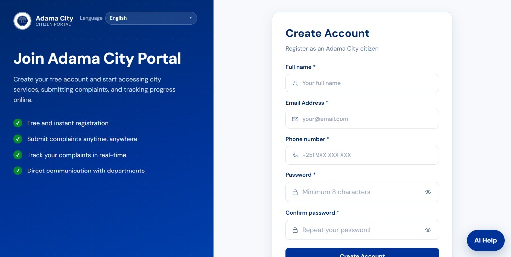 |
| 4.2 Guest registration |  |
| 4.3 Guest sign-in | 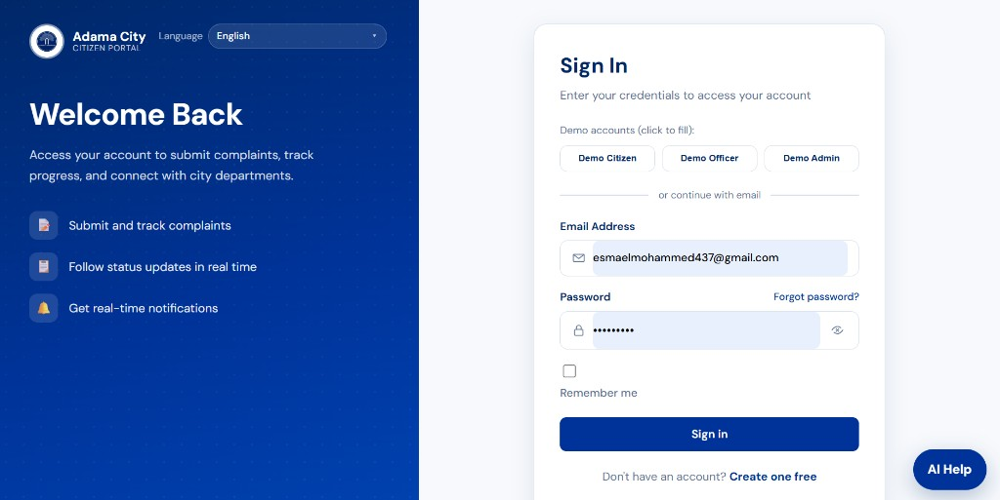 |

### Citizen

| Screen | Capture |
|--------|---------|
| Dashboard | 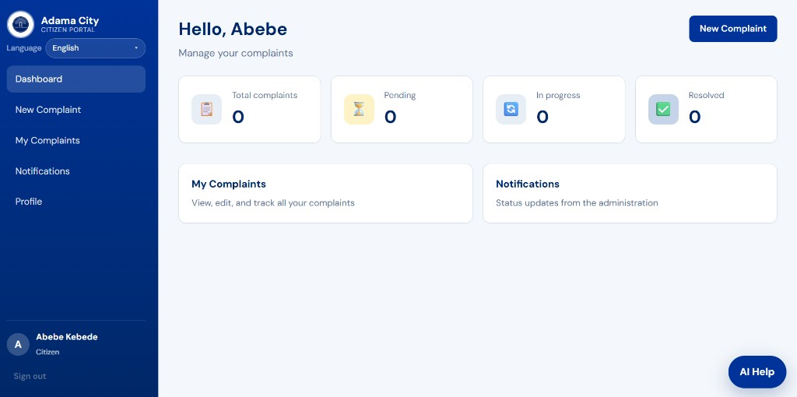 |
| Submit complaint | 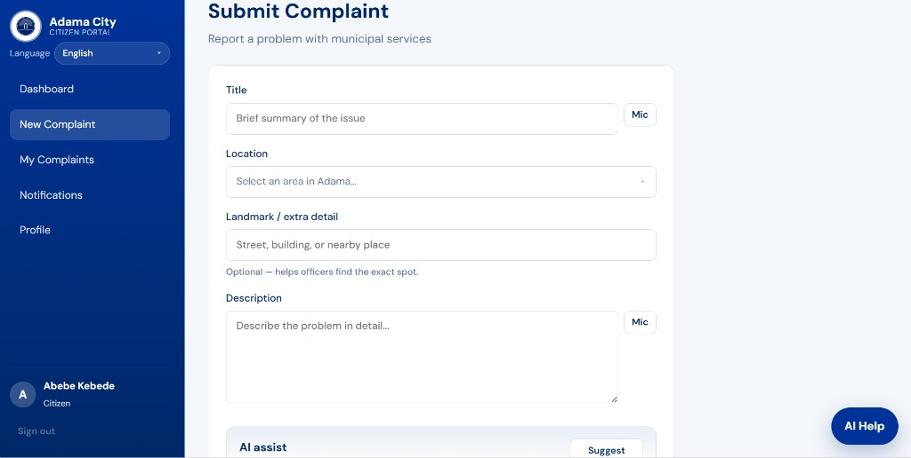 |
| My Complaints |  |
| Notifications (auto-seen) |  |
| Profile |  |

### Officer

| Screen | Capture |
|--------|---------|
| Dashboard | 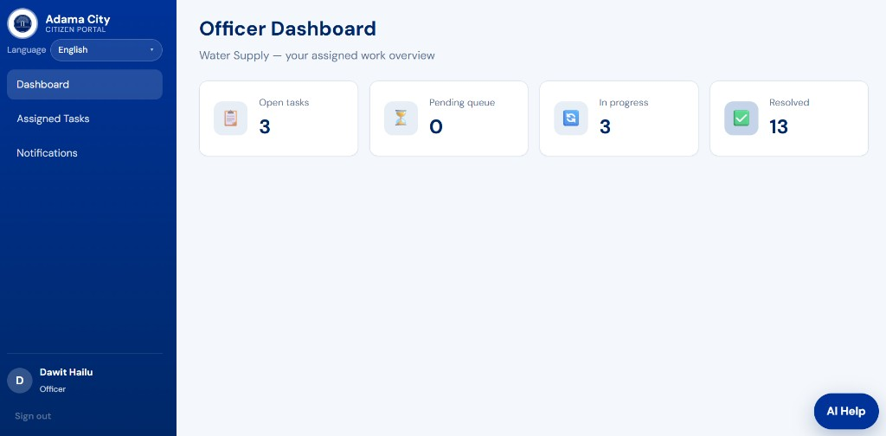 |
| Assigned Tasks | 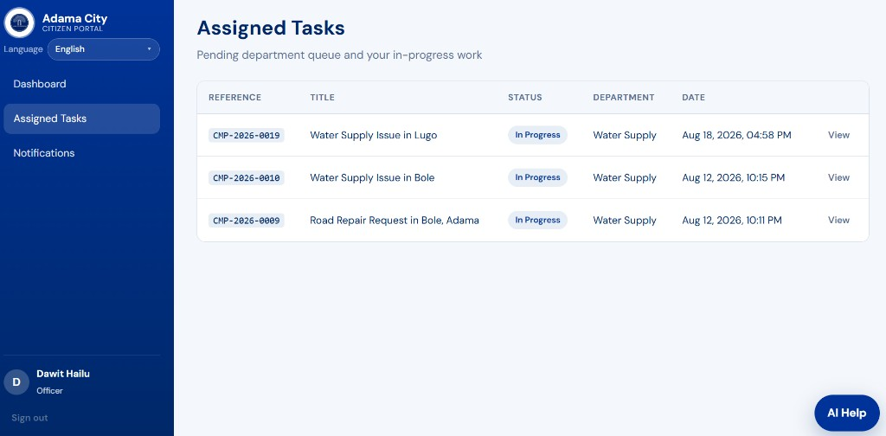 |
| Notifications |  |

### Administrator

| Screen | Capture |
|--------|---------|
| Dashboard | 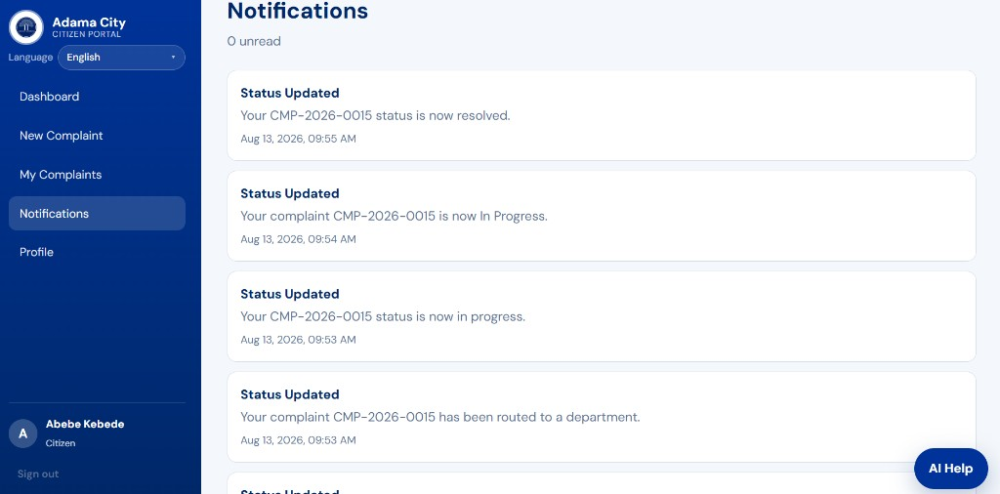 |
| Manage Complaints | 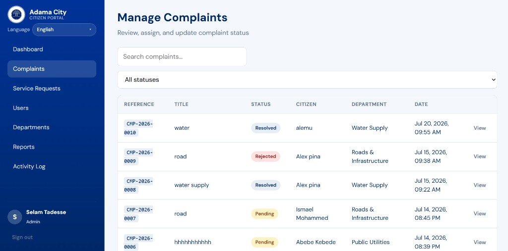 |
| Users | 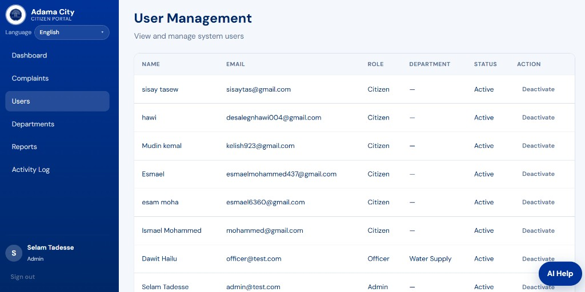 |
| Reports | 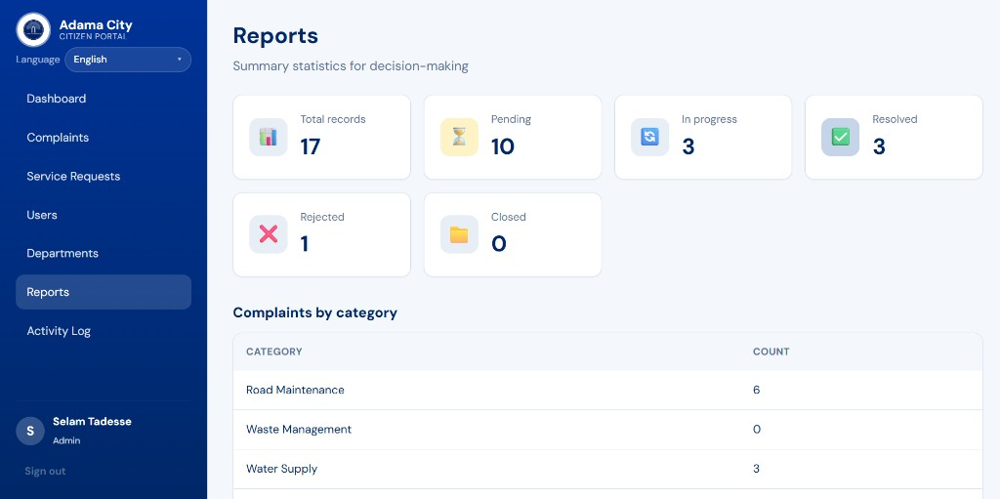 |
| Activity Log | 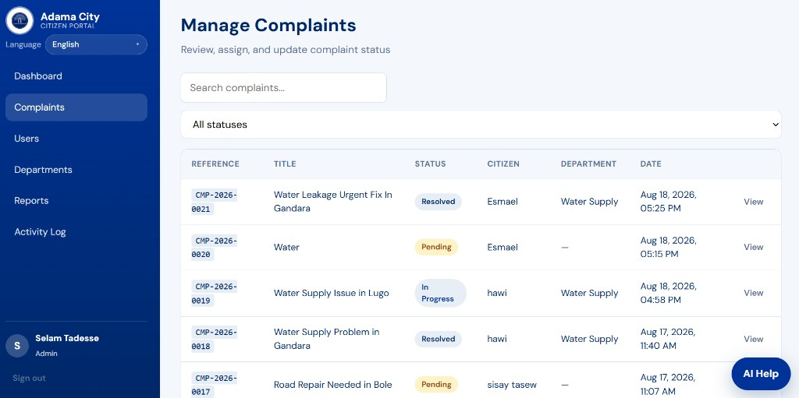 |

## Remaining work

- Full user / department edit-delete, report export, pagination
- Production deployment (HTTPS, backups)
- Live SMS (Africa’s Talking is sandbox-ready, off by default)
- GIS / map pin on top of the Adama area dropdown
